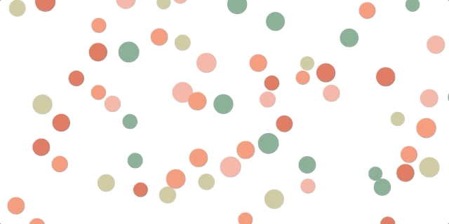
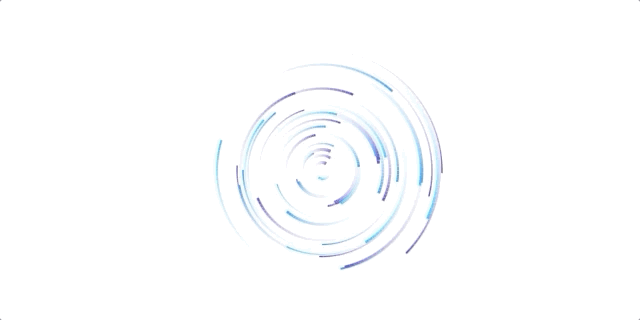

## HTML Canvas - Demos

This is a practice project to learn more about HTML5 canvas, draw shapes, add animation and add interactions.

A demo hosted github pages can be found [here](https://jayfarei.github.io/html5_canvas_demo/)


## Features of this project are:
- Dynamically adjust the size of the canvas to the window & resizing post loading via eventlistener
- Random circles generation and motion (within parameters)
- Canvas borders collision animation
- Interaction with mouse

## Collision 


## Interaction


## Circular motion



## Resources:
- Colour palette picked using [coolors.co](https://coolors.co/cc5803-e2711d-ff9505-ffb627-ffc971)
- Extension: [VSCode live server ](https://github.com/ritwickdey/vscode-live-server)
- Elastic collision [wiki page](https://en.wikipedia.org/wiki/Elastic_collision)


### Notes:
- removed radius increase within mouse position area
- parametrised animation to speed up testing
- adjusted random generation to avoid overlapping circles
- implemented nested object for velocity
```
var velocity = {
            x: (Math.random() - 0.5) * speedMultiple, // horizontal velocity 
            y: (Math.random() - 0.5) * speedMultiple // vertical velocity
        }
```
- distance detection
- collision reaction (elastic)


### Other JS based animation frameworks:
* a popular tool of choice for 3D webGL is [three.js](http://threejs.org/)
* a popular choice for 2D webGL is [pixi.js](http://www.pixijs.com/).
* practice on SVG for smaller animation 
* an other good library/abstraction on top of canvas is [anime.js](https://animejs.com) / the cool thing about it, you can animate any DOM object (SVG)